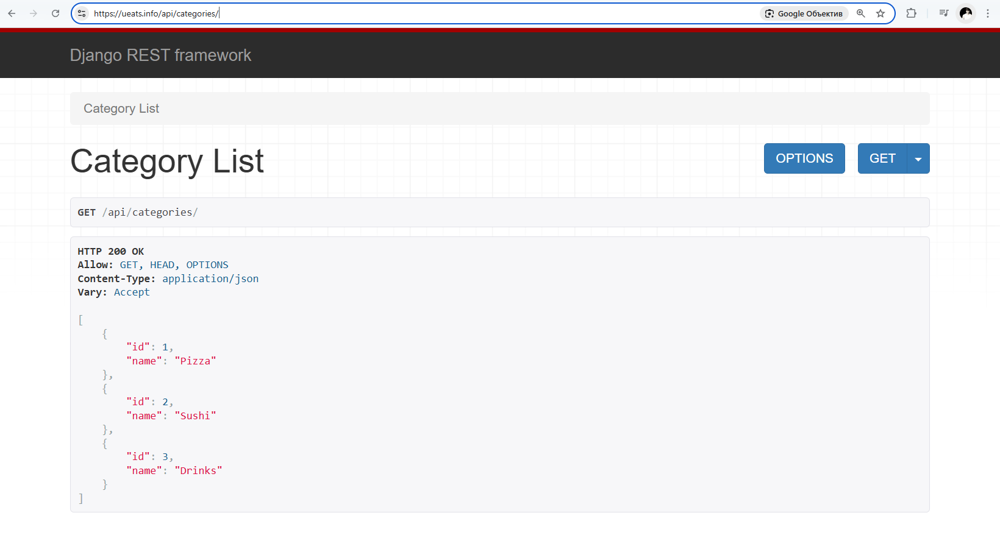
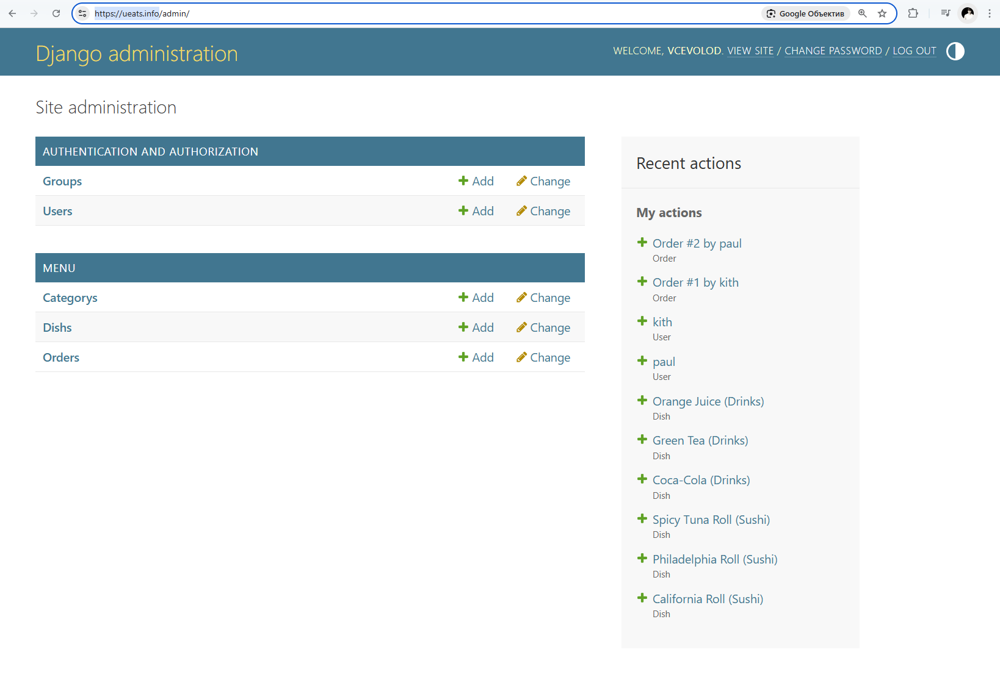
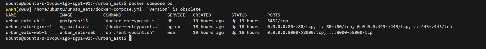
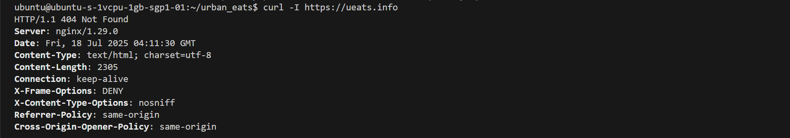

# UrbanEats — Food Delivery Menu API (Dockerized)

UrbanEats is a portfolio-level REST API project for managing food delivery menus and orders. Built with Django and PostgreSQL, containerized using Docker, and deployed to a VPS with Nginx + Gunicorn + HTTPS via Let's Encrypt.

🌐 Live demo (admin panel): [https://ueats.info/admin/](https://ueats.info/admin/)

---

## Features

- View menu categories and dishes
- Place and manage orders via API
- Django admin panel
- JWT authorization
- PostgreSQL as production database
- Static file serving via Nginx
- HTTPS enabled with Certbot
- Dockerized for easy deployment

---

## API Endpoints

- `GET /api/categories/` — list of categories
- `GET /api/dishes/` — list of dishes
- `POST /api/orders/` — create order
- `GET /api/orders/` — list user orders *(auth required)*

---

## Admin Access

- Admin Panel: [https://ueats.info/admin/](https://ueats.info/admin/)
- Demouser: `demo_user / demo12345`

---

## Deployment Stack

- **Backend:** Django + DRF
- **Database:** PostgreSQL (in Docker volume)
- **Server:** VPS (Ubuntu 22.04)
- **App Server:** Gunicorn
- **Proxy:** Nginx
- **SSL:** Let's Encrypt via Certbot
- **Containers:** Docker Compose (web, db, nginx, certbot)

---

## Screenshots

| Screenshot | Description |
|-----------|-------------|
|  | Public API `/api/categories/` |
|  | Django Admin panel |
|  | Dish list in Admin |
|  | Order edit page |
|  | VS Code project structure |
|  | `docker compose ps` |
|  | Certbot certificate success |
|  | `curl -I https://ueats.info` |

---

## Run Locally with Docker

```bash
git clone https://github.com/yourusername/urban_eats.git
cd urban_eats
cp .env.example .env  # or create your own .env file

# Build and run the containers
docker compose up -d --build

# Run Certbot manually once (for HTTPS)
docker compose run --rm certbot

# View logs if needed
docker compose logs -f web
```

---

## Notes

Before moving to Docker, this project was also deployed manually to the same VPS using virtualenv + Gunicorn + Nginx + PostgreSQL installed directly on the system. This showcases experience with both traditional and containerized deployment methods.

---

<details>
<summary><strong>🇷🇺 Нажмите, чтобы прочитать описание на русском</strong></summary>

# UrbanEats — API Меню доставки еды (Docker + VPS)

**UrbanEats** — это полноценный API-проект с авторизацией, административной панелью и хранением заказов. Реализован на Django, использует PostgreSQL, упакован в Docker и развернут на удалённом сервере (VPS) с поддержкой HTTPS.

🌐 Демо: [https://ueats.info/admin/](https://ueats.info/admin/)

---

## Функциональность

- Просмотр меню и категорий
- Создание заказов через API
- Авторизация по токену
- Панель администратора Django
- Продвинутая база — PostgreSQL
- Docker и `docker-compose`
- Nginx + Gunicorn
- HTTPS (Let's Encrypt Certbot)

---

## Примеры API

- `GET /api/categories/` — список категорий
- `GET /api/dishes/` — список блюд
- `POST /api/orders/` — создать заказ
- `GET /api/orders/` — список заказов пользователя (требует авторизации)

---

## Доступ в админку

- URL: [https://ueats.info/admin/](https://ueats.info/admin/)
- Пользователь: `demo_user / demo12345`

---

## Технологический стек

- **Язык:** Python + Django REST Framework
- **БД:** PostgreSQL (в Docker-томе)
- **Сервер:** VPS (Ubuntu)
- **Gunicorn + Nginx**
- **HTTPS:** Certbot / Let's Encrypt
- **Dockerized:** через Docker Compose

---

## Скриншоты

(см. английскую версию выше)

---

## Запуск локально (Docker)

```bash
git clone https://github.com/yourusername/urban_eats.git
cd urban_eats
cp .env.example .env

docker compose up -d --build
docker compose run --rm certbot
```

---

## Дополнительно

До перехода на Docker, этот проект был развёрнут вручную на том же VPS: установка Python, PostgreSQL, настройка Gunicorn + Nginx + systemd. Это показывает владение как ручным, так и контейнерным деплоем.

</details>