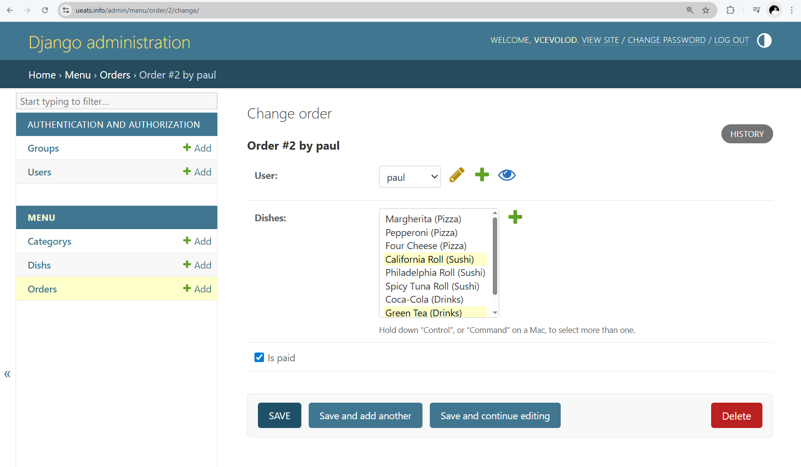

# UrbanEats 🍽️

UrbanEats is a backend API project developed as part of a self-driven portfolio to showcase real-world experience with Django, PostgreSQL, and production deployment on a VPS.  
It is deployed on a live server and designed to simulate a real-world food delivery backend system.

---

## 🚀 Features

- View food menu categories and dishes
- Place orders via API
- JWT authorization
- Django Admin panel
- Manual deployment to a VPS (Ubuntu) with Gunicorn + Supervisor + Nginx

---

## 🔧 Tech Stack

- **Backend:** Django + Django REST Framework
- **Database:** PostgreSQL
- **Web server:** Nginx
- **Application server:** Gunicorn
- **Process control:** Supervisor
- **OS:** Ubuntu 22.04 (on DigitalOcean VPS)
- **Python venv**

---

## 📂 Project Structure


---

## 📸 Screenshots

### API `/api/categories/`


### Django Admin Interface
- Main admin dashboard
  
- Dishes section
  
- Orders management
  

### Deployment Status
Supervisor, Nginx and migration status from terminal:


---

## 🧪 API Access (Demo)

- 🌐 **Base URL:** http://139.59.98.98/
- 🔐 **Admin Panel:** http://139.59.98.98/admin/

_(Temporary access for portfolio review only)_

---

## 🛠️ Local Installation

```bash
git clone https://github.com/Vsevolod-Dubin/urban_eats.git
cd urban_eats/urban_eats
python3 -m venv env
source env/bin/activate
pip install -r ../requirements.txt
python manage.py migrate
python manage.py createsuperuser
python manage.py runserver
```

---

## 🔐 Deployment Summary (Manual VPS)

1. Create user `ubuntu` and secure SSH access
2. Install Python 3.10+, PostgreSQL, pip, venv
3. Clone project and create virtual environment
4. Install dependencies and apply migrations
5. Configure Gunicorn and Supervisor
6. Configure Nginx to proxy requests to Gunicorn
7. Collect static files with `python manage.py collectstatic`

---

## 🧾 Author

This project was created independently to demonstrate hands-on backend and DevOps skills.  
It runs on a production-like server with a real database, static files, process management, and API endpoints.

---

## 📄 License

MIT License (or your preferred license)